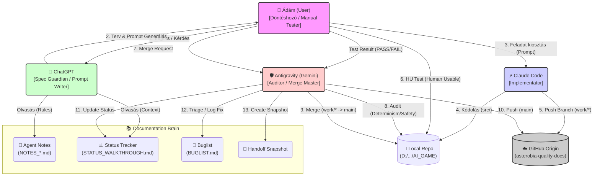

# Asterobia Agentic Workflow Visualization

Ez a dokumentum vizualizálja az Asterobia projekt fejlesztési folyamatát (Protocol v1), ahogyan azt a `docs/` mappa fájljai (`START_HERE.md`, `NOTES_*.md`, `PLANNING_PROTOCOL.md`) meghatározzák.

## Workflow Infographic (Mermaid)



## Részletes Szerepkörök

### 1. 👤 Ádám (User)
*   **Felelősség:** A folyamat motorja. Ő másolja a promptokat az ágensek között.
*   **Kizárólagos jog:** Döntéshozatal (Merge engedélyezése, Feature scope).
*   **Git:** **NEM** végez Git műveleteket (commit/push), ezt az ágensekre delegálja.
*   **Gates:** "HU Test Gate" - kötelező manuális tesztelés (pl. játék indítása) minden UI/Boot érintő változásnál.

### 2. 🧠 ChatGPT (Spec Guardian)
*   **Bemenet:** `HANDOFF_SNAPSHOT`, `STATUS_WALKTHROUGH`, `NOTES_CHATGPT`.
*   **Kimenet:** Részletes, kontextus-helyes **Promptok** a Claude Code vagy az Antigravity számára.
*   **Fókusz:** Nem kódol, hanem tervez. Őrzi a specifikációt (`start_here.md`).

### 3. ⚡ Claude Code (Implementation)
*   **Fókusz:** "Deep Coding". Bonyolult algoritmusok, refaktorálás.
*   **Szabály:** Soha nem pushol `main`-re közvetlenül. Mindig `work/...` branch-en dolgozik.
*   **Output:** Kód (`src/`) + Tesztek.

### 4. 🛡️ Antigravity (Auditor & Merge Master)
*   **Fókusz:** Minőségbiztosítás, Dokumentáció szinkron, Biztonság.
*   **Audit:** Ellenőrzi a Claude által írt kódot (Determinism check, Style check) merge előtt.
*   **Admin:** Frissíti a `STATUS_WALKTHROUGH.md`-t, `BUGLIST.md`-t és kezeli a verziókövetést.
*   **Handoff:** Elkészíti a Snapshot-ot a következő munkamenethez.

## Adatfolyam (Data Flow)

1.  **Code Flow:** `Claude (work/*)` -> `Ádám (Test)` -> `Antigravity (main)` -> `GitHub`.
2.  **Doc Flow:** `Antigravity` -> `Docs/*.md` -> `ChatGPT (Context)`.
```
