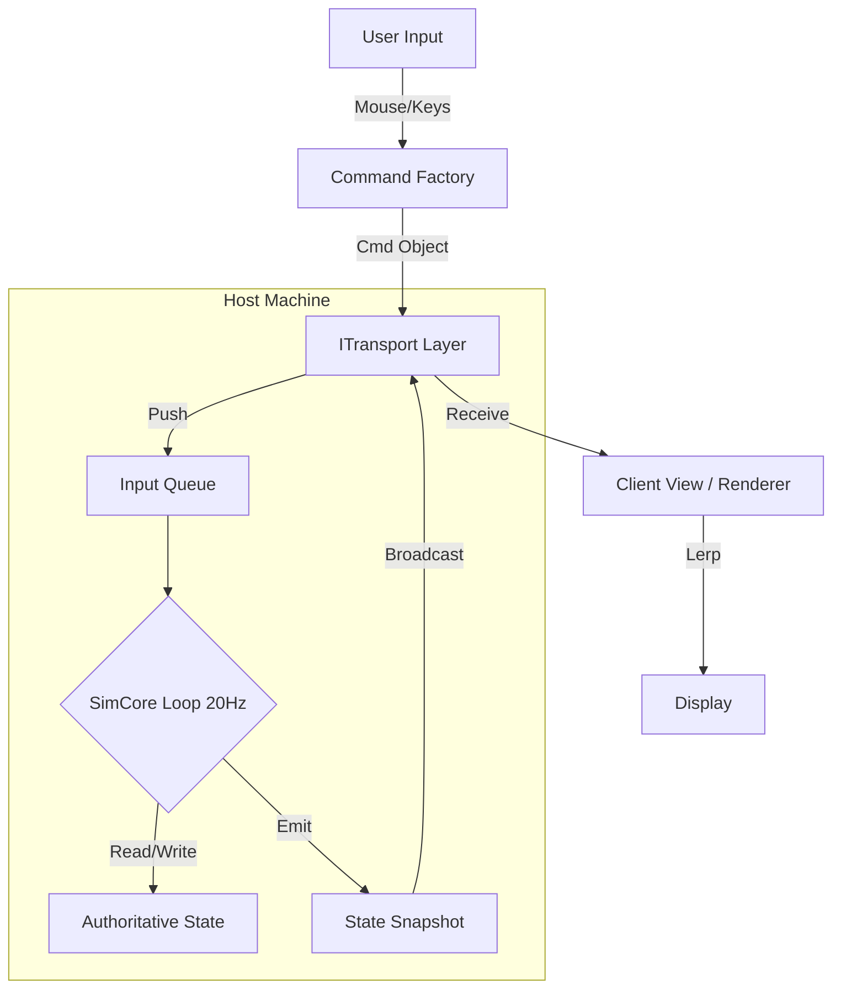

# ASTEROBIA — BIG PICTURE MASTER DEVELOPMENT PLAN (v1)
**Date:** 2026-01-21
**Status:** **READY FOR PLAN REVIEW**
**Author:** Antigravity (Gemini)
**Target Branch:** `work/release-000-big-picture-master-plan-antigravity`
**Scope:** End-to-End Implementation (Phase 0 Netcode + Phase 1 Features + Multiplayer)

---

## 1. Definition of Done & Read Gate

### 1.1 Read Gate Compliance
I have strictly adhered to the Read Gate Protocol.
- **Proof of Read:** [Appendices/PROOF_OF_READ_GATE.md](./appendices/PROOF_OF_READ_GATE.md)
- **Tracked MD Index:** [Appendices/MD_FILE_INDEX.txt](./appendices/MD_FILE_INDEX.txt)
- **Hard Stop Checks:** All mandatory RAW links were opened. *Note: Quality Archive links 404'd on remote Main, but were read from local disk.*

### 1.2 "Done Means" For This Plan
This plan is considered **complete** when it provides sufficient detail for a competent dev team (Claude Code + Antigravity) to execute the project from "Netcode Readiness" to "Full Multiplayer R&D Gameplay" without major architectural backtracking.

**The Project is "Done" when:**
1.  **Engine:** Runs on a deterministic, fixed-timestep `SimCore` (20Hz) decoupled from the render loop.
2.  **Multiplayer:** Supports 2+ players in a Host-Authoritative session (initially Local/P2P, utilizing Supabase for Signaling).
3.  **Gameplay:** The full **G-R-F-Tr-D-P-U** pipeline is active. Units can be Designed, Produced, Trained, and command the field.
4.  **Content:** All 7 canonical features (Move, Shoot, Perc-Opt, Perc-Scan, Mine, Trans, Shape) are implemented and interact correctly.

---

## 2. Table of Contents
*Note: To meet the "Deep Plan" requirement, this Master Plan is split into focused Appendices.*

1.  **[Main Plan (This Document)](./BIG_PICTURE_MASTER_PLAN_v1_ANTIGRAVITY.md)**
    *   Executive Strategy
    *   Scope Map
    *   Architecture Overview
2.  **[Appendix 01: Architecture & Netcode Stack](./appendices/APPENDIX_01_ARCHITECTURE_AND_NETCODE.md)**
    *   SimCore Kernel, Transport Layer, Backend (Supabase/WebRTC), Determinism.
3.  **[Appendix 02: Feature Implementation Chain](./appendices/APPENDIX_02_FEATURE_IMPLEMENTATION.md)**
    *   The GRFDTRDPU Cycle, Feature Specifications, Interaction Matrix.
4.  **[Appendix 03: Work Breakdown (Releases & Sprints)](./appendices/APPENDIX_03_RELEASES_AND_TASKS.md)**
    *   Phase 0 (Foundation) & Phase 1 (Features) detailed task lists.
5.  **[Appendix 04: Quality, Testing & Risks](./appendices/APPENDIX_04_RISKS_AND_QA.md)**
    *   QA Strategy, Observability, Risk Register.

---

## 3. Scope Map

### 3.1 Included (In Scope)
*   **Netcode Foundation:** Rewriting `Game.js` / `Unit.js` into the `SimCore` pattern.
*   **Locomotion:** Rolling physics (`MOVE_ROLL`), Inertia/Mass model, Terrain Constraints.
*   **Combat:** Direct fire (`WPN_SHOOT`), Health/Damage model.
*   **Economy:** Matera Mining, Transport (Hauling), Surface Piles.
*   **Perception:** Optical Vision (Line-of-Sight), Fog of War, Subsurface Scan.
*   **Creation:** Unit Designer (UI + Logic), Manufacture (Production).
*   **Multiplayer:** Host-Auth logic, Local Loopback transport, P2P implementation.

### 3.2 Excluded (Out of Scope for v1)
*   **Server-Side Simulation:** We are building *Host-Authoritative*. True Headless Server logic is Phase 2.
*   **Advanced AI:** "Mirror AI" is a behavior tree stub, not a deep learning agent.
*   **Flying Units:** `MOVE_FLY` is explicitly Phase 2.
*   **Shields / Stealth:** Mentioned in specs but scheduled for later releases.

---

## 4. Architecture Overview

**Goal:** Transform the current "monolithic hack" into a **Data-Driven, Deterministic Simulation**.

### 4.1 The "SimCore" Kernel
*   **Reference:** `subject://quality/NETCODE_READINESS_AUDIT.md`
*   **Philosophy:** The Simulation (`SimCore`) is the only source of truth. The Visuals (`View`) are just a fancy log viewer.
*   **Loop:** The Sim ticks at **20Hz** (50ms). This is a *hard/fixed* timestep.
*   **State:** Stored in a unified `SimState` tree (Entities, Terrain, Globals).
*   **Input:** The Sim *never* reads mouse/keyboard directly. It reads a `CommandQueue` populated by the View.

### 4.2 The "View" (Render Layer)
*   **Technology:** Three.js (existing).
*   **Role:** Stateless renderer.
*   **Interpolation:** Since Sim ticks at 20Hz and Screen at 60Hz/144Hz, the View must interpolate Entity positions between `State_Previous` and `State_Current`.
*   **Prediction:** For the local player, we may implement "Client Prediction" (displaying inputs immediately) in Phase 1.5, but Phase 0 starts with simple interpolation.

### 4.3 Data Flow Structure

---

## 5. Multiplayer Endgame Plan

**Target:** **Host-Authoritative Lockstep-Ready**
*   **Reference:** `subject://quality/MULTIPLAYER_TARGET_CHOICE.md`

### 5.1 Transport Options & Decision
*   **Option A: Websockets (Client-Server)**
    *   *Pros:* Standard, easy.
    *   *Cons:* Requires a Node.js server to relay messages (latency, cost).
*   **Option B: WebRTC (P2P)**
    *   *Pros:* Lowest latency, free (after signaling).
    *   *Cons:* Complex NAT traversal (ICE/STUN/TURN).
*   **Decision:** **Hybrid P2P (PeerJS / SimplePeer)** using **Supabase** for Signaling.
    *   Why? Fits "Host-Auth" best. No heavy server needed.

### 5.2 Backend Responsibilities (Supabase)
Even without a game server, we need a "Control Plane":
1.  **Authentication:** Who are you? (Supabase Auth).
2.  **Signaling:** "I am Host A, looking for Player B" (Supabase Realtime / DB).
3.  **Persistence:** Saving Blueprints / Unit Designs (Supabase DB).

---

## 6. R&D / Development / Production (GRFDTRDPU)

**Concept:** The game loop is not just "fighting". It is an **Evolutionary Pipeline**.
*   **Reference:** `subject://spec_sources/ASTROBIA_CANONICAL_GRFDTRDPU_SYSTEM_2026-01-13.md`

### 6.1 Integration Strategy
*   **Goals (G):** Logic that monitors state and creates "Needs" (e.g., "Need more Range").
*   **Research (R):** A job queue that unlocks new `TypeBlueprints` or Stat Multipliers.
*   **Design (D):** The UI where players allocate "Capacity" to Feature Axes.
*   **Production (P):** The "Factory" logic that spawns Unit Entities.

### 6.2 Tech Stack for R&D
*   **Blueprints:** JSON objects stored in `SimState` (for the match) and `Supabase` (permanent library).
*   **Versioning:** Strict `Name + Version` hashing (e.g., `MORDIG-12`).

---

## 7. Open Decisions

1.  **Physics Library:** Do we adopt Cannon.js/Rapier or keep custom spherical physics?
    *   *Constraint:* `MOVE_ROLL` implies complex ground interaction.
    *   *Recommendation:* Stick to Custom "Game Physics" (Point-mass on Sphere) for Release 0-5. Migrate only if stability fails.
2.  **Matera Persistence:** How detailed is the voxel digging?
    *   *Recommendation:* Variable-resolution grid. High res near changes, low res elsewhere.

---
*End of Main Document. See Appendices for Implementation Details.*
