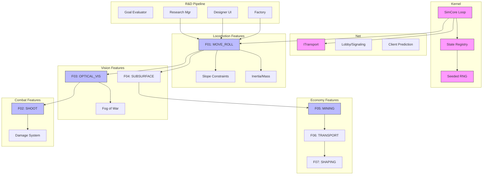

# APPENDIX D: FEATURE DEPENDENCY GRAPH (v3)

**Parent Document:** [Big Picture Master Plan v3](../BIG_PICTURE_MASTER_PLAN_v1_ANTIGRAVITY.md)
**Scope:** Visual dependency mapping and Critical Path Analysis.

---

## 1. Critical Path Analysis

The project success relies on a strict sequence. We cannot build "Combat" before "Locomotion" because Combat relies on positioning.

**The Golden Path:**
1.  **SimCore (Kernel)** - The brain.
2.  **Transport** - The nervous system.
3.  **Locomotion** - The legs.
4.  **Perception** - The eyes.
5.  **Interaction** - The hands (Mining/Shooting).

---

## 2. Dependency Graph (Mermaid)

---

## 3. Module Interaction Matrix

| Module | Needed By | Provides |
| :--- | :--- | :--- |
| **Locomotion** | Combat, Mining, Transport | `Position`, `Velocity` |
| **Vision** | Combat, Mining | `VisibleEntities[]` |
| **Inventory** | Transport, Mining | `CargoCapacity`, `MassModifier` |
| **Stats** | Locomotion, Combat | `Speed`, `Range`, `Damage` |

---
*End of Appendix*
