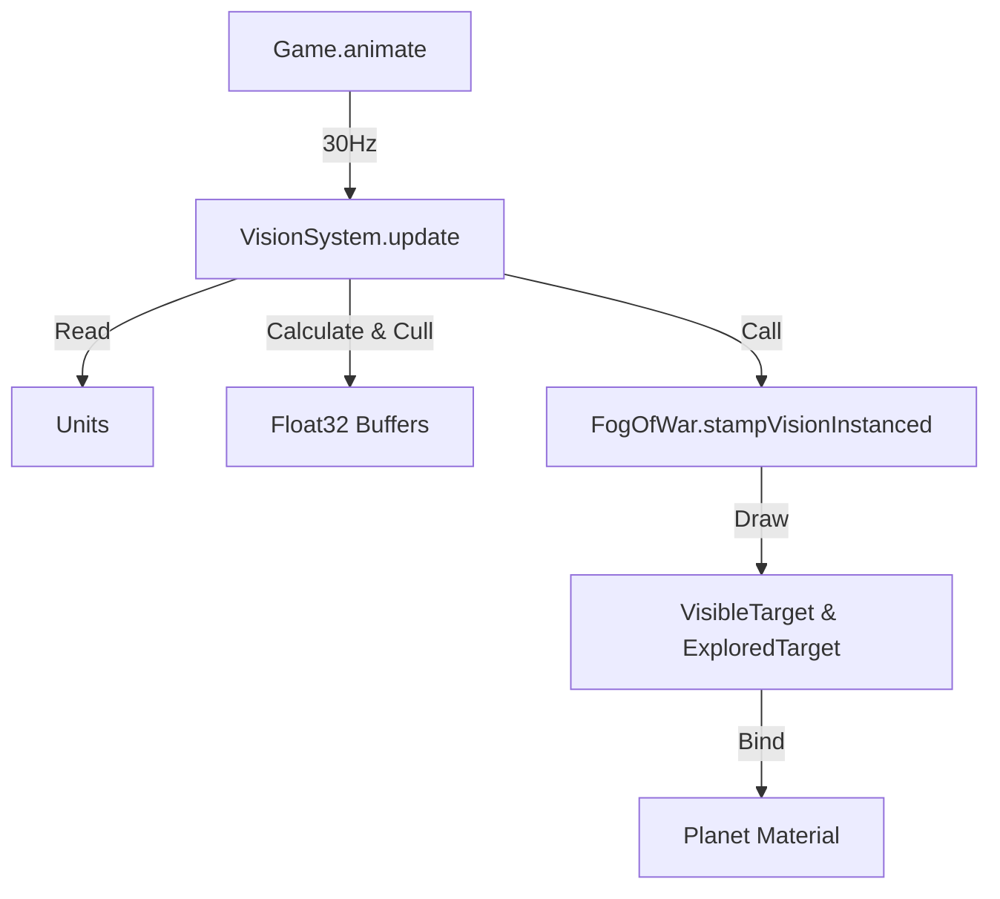

# VISION & FOW SYSTEM: REFACTOR AUDIT

## 1) CURRENT ARCHITECTURE MAP

**Core Components:**

| File / Class | Responsibility | Key Methods |
| :--- | :--- | :--- |
| `src/SimCore/runtime/VisionSystem.js` | **LOGIC (Controller)**<br>Collects units, calculates radii, handles UV wrapping, builds instance buffers. | `update(units, camera)`<br>`collectSources()`<br>`buildBuffers()` |
| `src/World/FogOfWar.js` | **RENDERING (Service)**<br>Manages GPU RenderTargets, Shaders, and InstancedMesh. | `stampVisionInstanced(visionSystem)`<br>`renderVisionInstanced()`<br>`constructor(renderer)` |
| `src/Core/Game.js` | **ORCHESTRATOR**<br>Main loop driver. | `animate()` -> `visionSystem.update()` |
| `src/Entities/Unit.js` | **DATA SOURCE**<br>Provides position & stats. | `model.effectiveStats.vision` |
| `src/World/Planet.js` | **CONSUMER**<br>Binds FOW textures to terrain shaders. | `createMesh()`<br>`createWaterMesh()` |

**Update Flow:**


**Seam Wrapping:**
-   **Implemented in:** `VisionSystem.handleSeamWrapping()`
-   **Method:** Detects sources crossing UV 0/1 boundary and duplicates them with +/- 1.0 UV offset.

**Max Sources:**
-   **Enforced in:** `VisionSystem.collectSources`
-   **Limit:** `Math.min(config.maxSources, 256)` (Buffer size limit).
-   **Sorting:** Sorted by distance to camera before culling.

---

## 2) FOG TEXTURES & SHADER CONTRACT

**Render Targets:**
-   **Visible:** `this.visibleTarget` (RGBA, FloatType, LinearFilter, 2048x2048).
-   **Explored:** `this.exploredTarget` (RGBA, FloatType, LinearFilter, 2048x2048).
-   **Accumulation:** In `renderVisionInstanced()`, `visibleTarget` is drawn first (Clear+Draw), then drawn *additively* into `exploredTarget` (NoClear).

**Shader Contract (Planet.js):**
The `Terrain` and `Water` shaders consume these via `MeshStandardMaterial.onBeforeCompile`.

| Uniform Name | Source Texture | Channel Usage | Logic |
| :--- | :--- | :--- | :--- |
| `uFogTexture` | `exploredTarget.texture` | **Red (R)** | 0.0=Unexplored, 1.0=Explored |
| `uVisibleTexture` | `visibleTarget.texture` | **Red (R)** | 0.0=Hidden, 1.0=VisibleNow |

**Integration Points:**
-   `Planet.createMesh()`: Injects uniforms `uFogTexture`, `uVisibleTexture`.
-   `Planet.createWaterMesh()`: Injects same uniforms.
-   `Planet.createStarField()`: Uses `uFogTexture` to hide stars in unexplored space.

---

## 3) SOURCE COLLECTION (VISION SOURCES)

**Data Source:** `Unit.js`
**Field:** `unit.model.effectiveStats.vision` (Range: 0-100).

**Radius Calculation:**
```javascript
// src/SimCore/runtime/VisionSystem.js
const t = Math.min(visionPercent, 100) / 100;
const radiusMeters = lerp(config.minVisionRadius, config.maxVisionRadius, t);
```
-   `minVisionRadius`: Default 5m.
-   `maxVisionRadius`: Default ~40% of planet radius.

**Culling Logic:**
1.  Filter out 0 vision.
2.  Calculate UVs.
3.  Sort by `distToCamera` (Ascending).
4.  Slice first `config.maxSources`.
5.  Add Seam Wraps (if buffer space remains).

---

## 4) PERSISTENCE READINESS (MULTIPLAYER)

**Requirement:** Persist "Explored" state across sessions.

### **Strategy A: Async GPU Readback (Recommended for robustness)**
Snapshot the 2048x2048 `exploredTarget` texture to CPU periodically.
-   **Method:** `renderer.readRenderTargetPixels()` (Blocking in WebGL1, sync/slow) or `makeXRCompatible` + `gl.readPixels` with PBO (WebGL2). Ideally use `renderer.readRenderTargetPixelsAsync` (if Three.js version supports) or just accept a hiccup every autosave.
-   **Format:** Save as low-res PNG (e.g. 512x512) or Base64 string to LocalStorage.
-   **Restore:** Load image -> Draw 1xFullscreen Quad into `exploredTarget` on init.
-   **Risk:** Performance hiccup during save.

### **Strategy B: CPU-Side "Explored Mask" (Recommended for refactor)**
Maintain a low-res Grid (e.g., 256x128) on CPU that mirrors the "Explored" status.
-   **Method:** When units move, "paint" their vision circles onto this CPU grid (Uint8Array).
-   **Sync:** Upload this CPU grid to a *new* texture `uCpuExploredTexture` periodically, OR just rely on it for logic and let GPU handle visuals.
-   **For Persistence:** Easy to serialize `Uint8Array` to JSON/Binary.
-   **Visuals:** On load, render this CPU mask into the `exploredTarget` using a full-screen shader pass.

### **Strategy C: Event Replay**
Re-simulate all unit paths.
-   **Risk:** Impossible/Impractical for long games or arbitrary movement.

**Recommendation:** **Strategy B** (CPU Grid) is best for the requested "Source Collection" vs "World Service" split. The "Perception" layer can own the CPU Grid (Logic/Save), and the "World Service" just renders it.

---

## 5) REFACTOR PLAN (No Behavior Change)

**Goal:** Formalize `VisionSystem` (Logic/Perception) vs `FogOfWar` (Rendering/World).

### **Phase 1: Define Usage Contract**
Create a formal interface for `VisionUpdate`:
```typescript
interface VisionUpdate {
  sources: {
    position: Vector3; // World Space
    radius: number;    // Meters
    channel: number;   // 0=Player, 1=Ally... (Future proofing)
  }[];
  cameraPosition: Vector3;
}
```

### **Phase 2: Decouple Rendering**
1.  **Refactor `VisionSystem.js`:**
    -   Rename to `PerceptionSystem.js`.
    -   Remove direct references to `fogOfWar.stampVisionInstanced`.
    -   Instead, expose `getSources()` or emit an event `onVisionUpdate(data)`.
    -   **New Responsibility:** Owns the `VisionStats` calculation and `SourceCollection`.

2.  **Refactor `FogOfWar.js`:**
    -   Rename to `VisionRenderer.js` or `FogOfWarService.js`.
    -   Add method `updateSources(sources: VisionSource[])`.
    -   Move `buildBuffers` logic INSIDE this service (it's a rendering concern, not logic). `VisionSystem` should just pass clean data objects, not raw GPU arrays.

3.  **Preserved Logic:**
    -   **Seam Wrapping:** Move to `VisionRenderer.js` (Rendering artifact). Logic shouldn't care about texture seams.
    -   **Update Throttle:** Keep in `PerceptionSystem` to limit calculation frequency.

### **Phase 3: Persistence (Future Step)**
1.  Implement **Strategy B (CPU Grid)** inside `PerceptionSystem`.
2.  On `PerceptionSystem.start()`, load grid from storage.
3.  Inject "Initial Explored State" into `VisionRenderer` to stamp it once.

### **Step-by-Step Refactor Sequence:**

1.  **Extract `VisionSource` Logic:**
    -   Move `collectSources` calculation (Stats -> Radius) to a pure helper function.
2.  **Clean `FogOfWar.js`:**
    -   Remove legacy `brushMaterial` / `quadGeometry` (Dead code).
    -   Expose explicit `bindToTerrain(material)` helper to standardize uniform injection.
3.  **Invert Control:**
    -   Change `Game.js`:
        ```javascript
        // Old
        this.visionSystem.update(units); // Internal logic calls FOW
        
        // New
        const visionData = this.perceptionSystem.update(units);
        this.fogRenderer.render(visionData);
        ```
4.  **Standardize Uniforms:**
    -   - Create a `FOWUniforms` constant object to prevent string typos in shaders.

**References:**
-   `src/SimCore/runtime/VisionSystem.js`: `collectSources` (Line 108)
-   `src/World/FogOfWar.js`: `renderVisionInstanced` (Line 311)
-   `src/World/Planet.js`: `createMesh` shader injection (Line 186)
